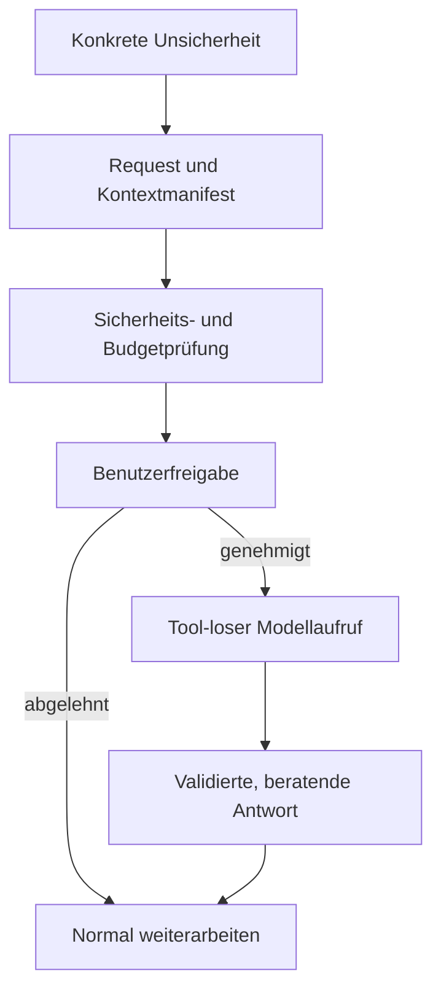

# Pi Second-Opinion Service

Version: 2.0
Status: Entwurfs- und Umsetzungspaket, noch keine Implementierung
Zielprojekt: Pi-Setup

## Zweck

Dieses Paket beschreibt eine kleine, kontrollierte Zweitmeinungsfunktion für technische Entscheidungen.

Der Hauptagent kann bei einer konkret benannten Unsicherheit eine zweite Modellmeinung beantragen. Der Benutzer sieht vor dem externen Modellaufruf, welches Modell welchen Kontext erhalten soll, und entscheidet ausdrücklich über die Freigabe.

Später kann derselbe Service zusätzlich aus geeigneten `ask_user`-Entscheidungen aufgerufen werden. Die Zweitmeinung bleibt immer beratend und wählt niemals selbst eine Option aus.

## Verbindliche Grundentscheidung

Der Core wird nicht als autonomer Subagent umgesetzt, sondern als zustandsarmer, tool-loser Modellaufruf hinter einem gemeinsamen `SecondOpinionService`.

Das Opinion-Modell erhält:

- keine Tools,
- keine Schreib- oder Ausführungsrechte,
- keine vollständige Session,
- nur einen vorab geprüften und freigegebenen Payload,
- keine automatische Möglichkeit zur Kontextnachladung.

## Paketinhalt

1. `01_Technische_Spezifikation.md`
   - Rollen, Architektur und Datenfluss
   - Request-, Payload- und Response-Vertrag
   - Approval, Provider-Regeln und Sicherheitsgrenzen
   - Fehlerverhalten, Telemetrie und `ask_user`-Zustände

2. `02_Arbeitsauftrag.md`
   - Phase 0: reine Repository- und Integrationsanalyse
   - Phase 1: agenteninitiierter Core-MVP
   - Phase 1.1: Nutzennachweis
   - Phase 2: `ask_user`-Integration
   - ausdrückliche Stop-Gates zwischen den Phasen

3. `03_Test_und_Evaluationsplan.md`
   - Funktions-, Sicherheits-, Fehler- und UI-Tests
   - Vergleich Hauptagent allein gegen Hauptagent plus Zweitmeinung
   - messbare Go-/No-Go-Kriterien

4. `04_Abnahmecheckliste.md`
   - kompakte Prüfliste für Review und Freigabe

## Empfohlene Reihenfolge

1. Nur Phase 0 ausführen und den aktuellen Base-SHA sowie konkrete Integrationspunkte dokumentieren.
2. Analyse prüfen und Phase 1 ausdrücklich freigeben.
3. Core-MVP implementieren und technisch testen.
4. Nutzennachweis aus Phase 1.1 durchführen.
5. Nur bei positivem Ergebnis Phase 2 für `ask_user` freigeben.

`ask_user` bleibt damit festes Ziel, wird aber nicht ungeprüft mit dem Core in einen einzigen großen Änderungsblock gepackt.

## Sofortige No-Go-Bedingungen

Nicht implementieren oder nicht aktivieren, wenn mindestens einer dieser Punkte zutrifft:

- Ein Modellaufruf kann ohne explizite Benutzerfreigabe stattfinden.
- Das Opinion-Modell erhält Tools oder kann Repository-Zustand verändern.
- Der tatsächlich versendete Kontext ist vor der Freigabe nicht bestimmbar.
- Sensitive Dateien oder Secret-ähnliche Inhalte können ungeprüft übertragen werden.
- Ein Provider-Fehler führt zu einem stillen Modell- oder Provider-Fallback.
- Die Zweitmeinung kann Plan, Gate, Verifier oder `ask_user`-Auswahl automatisch verändern.
- Die Implementierung erfordert eine zweite allgemeine Agentenplattform.

## Kurzform des Workflows

## Wichtige Abgrenzung

Der Service ist kein Verifier. Ein Verifier prüft ein fertiges Ergebnis gegen Kriterien. Die Zweitmeinung liefert vor oder während einer Entscheidung eine zusätzliche Perspektive. Sie besitzt weder Gate-Rechte noch Entscheidungsbefugnis.
